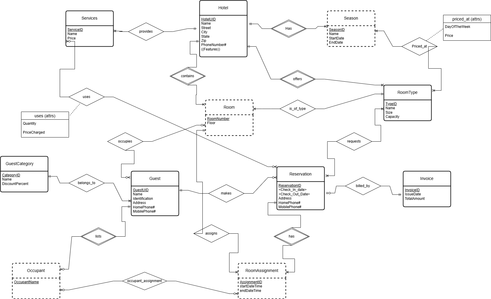
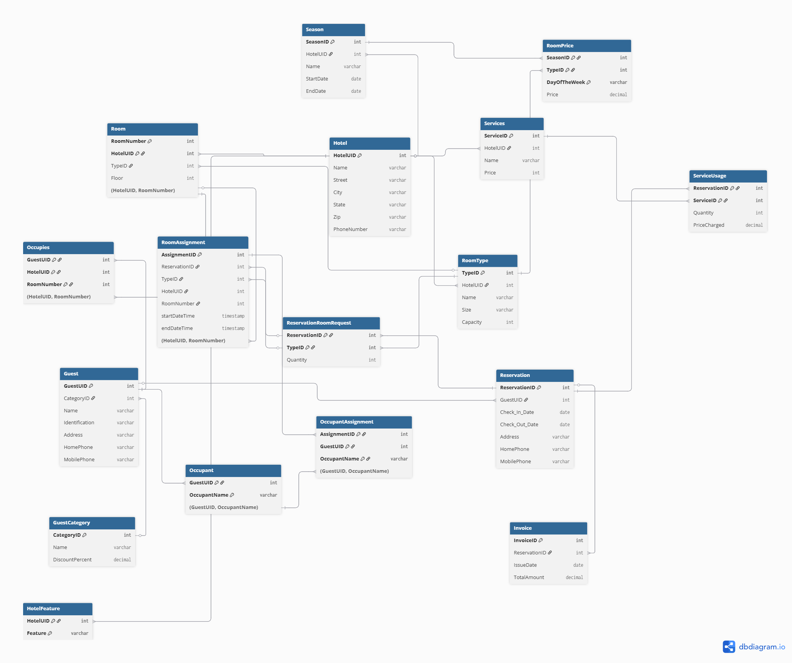
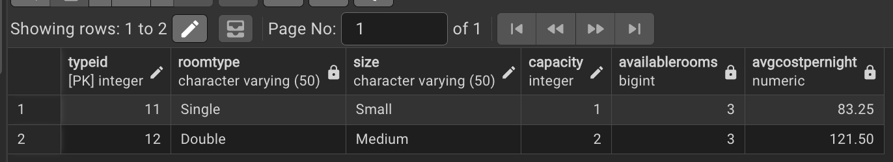
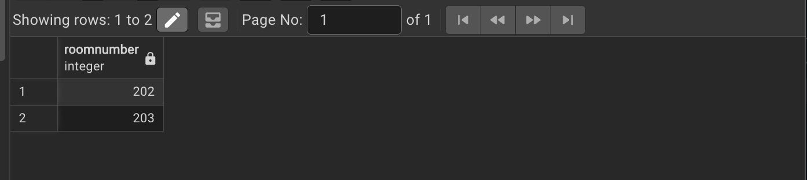
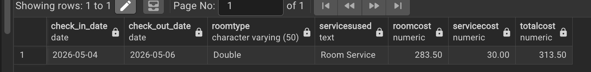
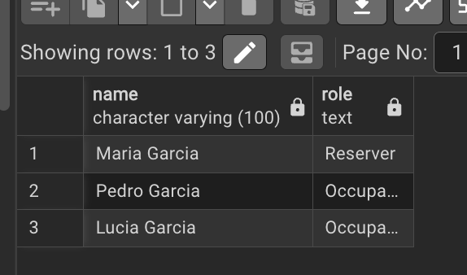

# CS374 Hotel Database Final Report
By: Alex Douglas, Danny Ramos

## ER Model

__OUR CHANGES__

## Relational Model

__OUR CHANGES__

So the problem that we ran into with our old implementation of the HW7 relational model was that we had no way to tell which occupants were staying in which rooms. The Occupant table just listed people tied to a guest, and RoomAssignment had which room each reservation got, but nothing linked them together. So to fix this we added a table to join them called OccupantAssignment since the relationship was many-to-many. It has AssignmentID as a foreign key to RoomAssignment, and GuestUID plus OccupantName as a composite foreign key to Occupant, with all three columns together as the primary key.

## Database creation

- Drop tables: [drop.sql](./database/drop.sql)
- Create tables: [create.sql](./database/alter.sql)
- Add constraints to tables: [alter.sql](./database/alter.sql)

__OUR CHANGES__

Since all we really changed to our new relational model was adding the relationship to Occupant and RoomAssignment as mentioned above, we really did not have to change much to our data base scripts. For our new create script we only had to add one new CREATE TABLE line at the end for our new OccupantAssignment table. We also added a DROP TABLE line for it at the top. For our new alter script that adds the foreign key contraints, we only had to add two new foreign key constraints at the end. One that links AssignmentID to the RoomAssignment table and the other one links the composite key of GuestUID and OccupantName to the Occupant table. Now lastly, for our new drop script, that drops the foriegn key contraints, we only had to add two new DROP CONSTRAINT statements at the end to match the two new foreign keys we added in the add script. That's it.

## Data

- Add some data from sql files: [load.sql](./data/load.sql)

__OUR CHANGES__

For our new load script, we only had to update one thing from our old hw7 load data script. We had to add one new INSERT block at the end for our new OccupantAssignment table that we talked about above that joins our Occupant and RoomAssignment entities. 

## Queries

### Query 1: Reservations
- [query1.sql](./queries/query1.sql)

A new Gold guest wants to reserve a room at Sunrise Hotel (Hotel A) from July 15–17, 2026. The SELECT returns all available room types for those two nights along with the average Gold-discounted nightly cost. We used a Summer 2026 season for Sunrise Hotel so the dates fall within a valid season, and all three Suite rooms are pre-booked by another reservation to ensure at least one room type comes back unavailable. The price differs between the two nights since July 15 is a Wednesday and July 16 is a Thursday, which have different rates in our data. The INSERT adds the new guest Alex Thompson and books him into a Double room for those dates.

*insert screenshot of SELECT results and data setup here*

### Query 2: Checking In
- [query2.sql](./queries/query2.sql)

Mr. and Mrs. Smith arrive at Grand Hotel (Hotel B) on May 4, 2026 for their Double room reservation. The SELECT returns all Double room numbers at Grand Hotel that are currently unoccupied. We pre-inserted James Lee into the Occupies table for room 201 so that room is excluded from the results, leaving rooms 202 and 203 as available. The INSERTs add Mr. Robert Smith as a new occupant under Mrs. Smith's guest record, assign room 202 to her reservation, link Mr. Smith to that assignment, and record Mrs. Smith as physically occupying the room.

*insert screenshot of SELECT results and data setup here*

### Query 3: Checking Out
- [query3.sql](./queries/query3.sql)

Two nights later (May 6, 2026), the Smiths check out. We added a Spring 2026 season for Grand Hotel since no existing season covered May 2026, and set Monday at $150 and Tuesday at $165 so the nightly price varies across the stay. The INSERT adds a Room Service charge ($30) to the reservation. The UPDATE closes out the room assignment with a checkout timestamp, the DELETE removes Mrs. Smith from Occupies, and the final INSERT records the invoice. The SELECT generates the billing statement showing the date range, room type, services used, and the total cost with Mrs. Smith's Gold discount applied — coming out to $313.50.

*insert screenshot of SELECT results and data setup here*

### Query 4: Find the Occupants
- [query4.sql](./queries/query4.sql)

This query finds everyone staying in a specific room on a specific date. Both the guest who made the reservation and any registered occupants. We use Hotel 1 room 101 on July 2, 2025 as the example, which returns three people: Maria Garcia (the reserver), Pedro Garcia, and Lucia Garcia. The query uses UNION ALL to combine the reserver from the Guest table with occupant names from OccupantAssignment, both filtered by matching the room assignment for that date.

*insert screenshot of SELECT results here*

### Query 5: Total Spending Over a Year
- [query5.sql](./queries/query5.sql)

This query finds the total amount spent at the chain for any guest who made at least 2 reservations across at least 2 different hotels in a given year.

*insert screenshot of SELECT results here*

