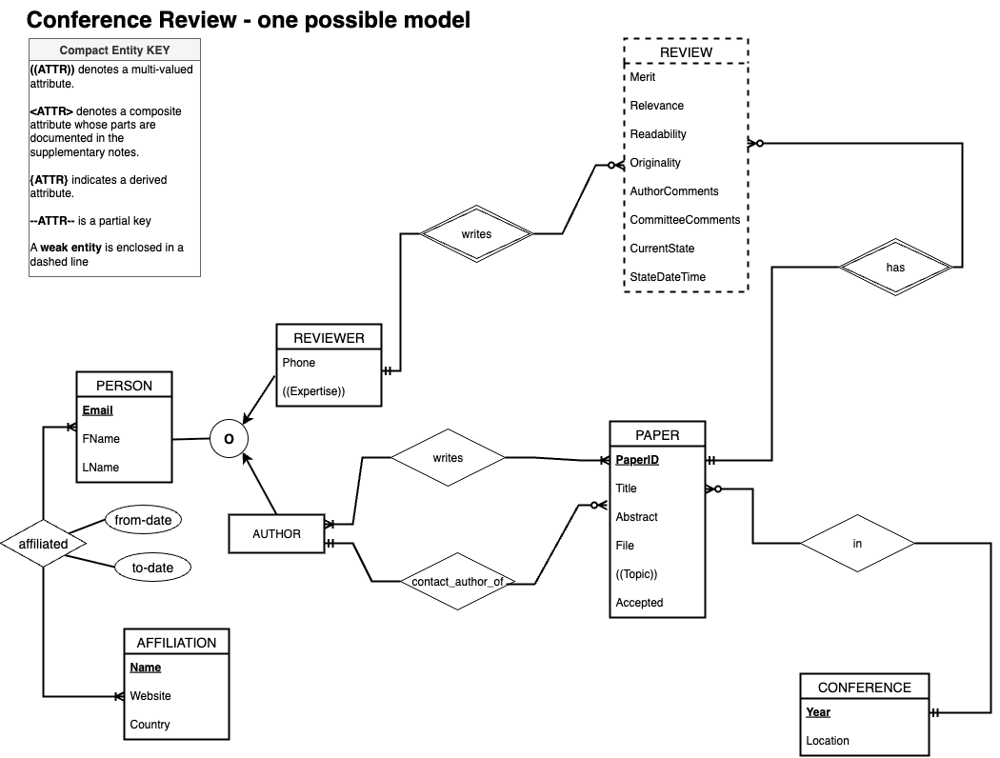
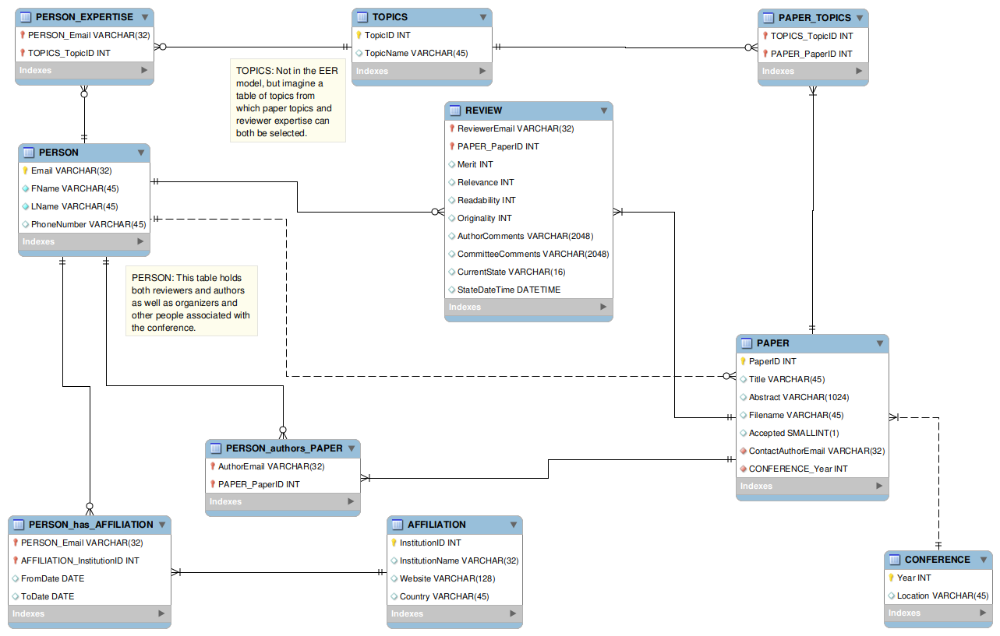
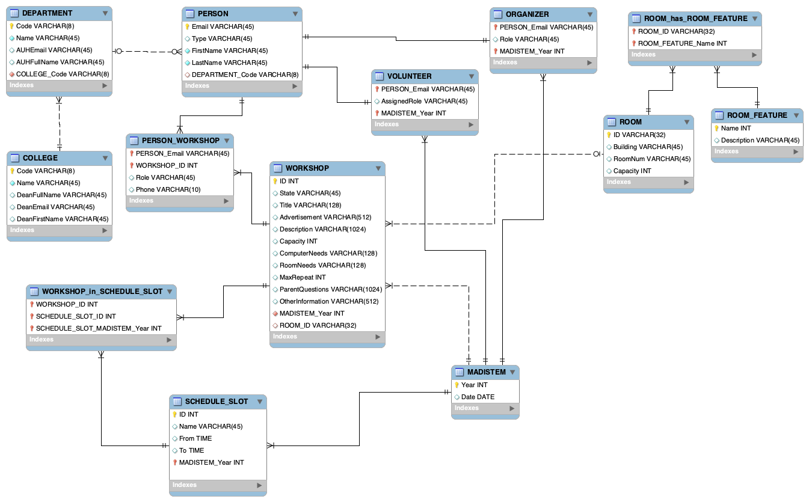
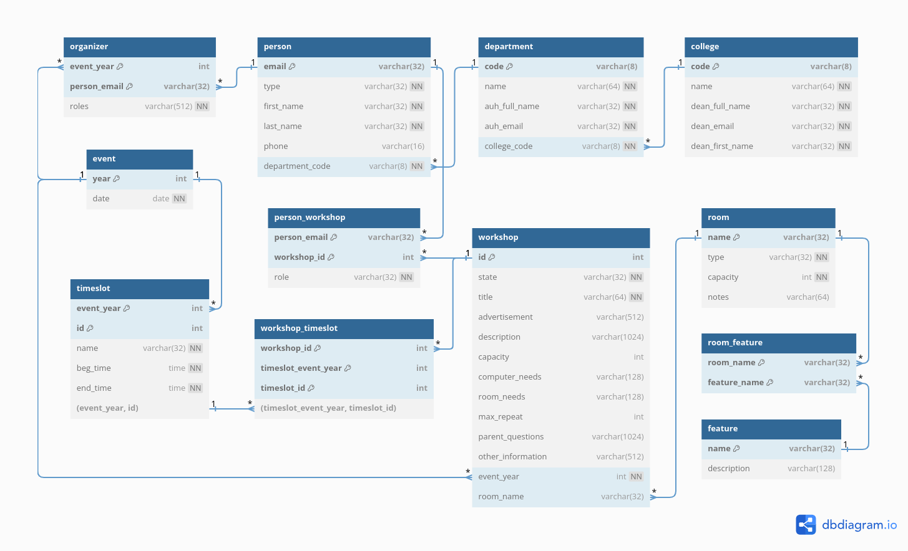

# CS374 Hotel Database Final Report
By: Alex Douglas, Danny Ramos

## ER Model
*insert the image here*

*describe any changes since HW7*

## Relational Model
*insert the image(s) here*

- Conference Review System: 
- madiSTEM System: 
- madiSTEM System (dbdiagram style): 

*Describe any changes since HW7*

## Database creation
*Link the files here*

- Drop tables: [drop.sql](./database/drop.sql)
- Create tables: [create.sql](./database/alter.sql)
- Add constraints to tables: [alter.sql](./database/alter.sql)

*They should be in a subdirectory called database*

*Describe any changes very briefly: for example:*

[maybe add if not delete]

## Data
*Link the files here*

- Add some data from sql files: [load.sql](./data/load.sql)

*They should be in a subdirectory called data*

*Describe any changes very briefly: for example:*

[maybe add if not delete]

## Queries

### Query 1
*Link the code file(s) here from subdirectory queries*

For example:
- [workshop_leader.py](./queries/workshop_leader.py)

*Describe the queries in detail with screenshots of the data setup and the results*

### Query 2
*Link the code file(s) here from subdirectory queries*

*Describe the queries in detail with screenshots of setup and results*

### Query 3
*Link the code file(s) here from subdirectory queries*

*Describe the queries in detail with screenshots of setup and results*

### Query 4
*Link the code file(s) here from subdirectory queries*

*Describe the queries in detail with screenshots of setup and results*

### Query 5
*Link the code file(s) here from subdirectory queries*

*Describe the queries in detail with screenshots of setup and results*
